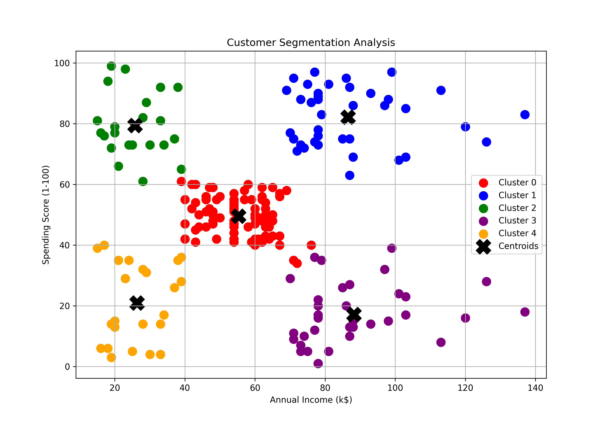

# Customer Segmentation Analysis using K-Means

## Project Overview
This project performs customer segmentation using Machine Learning techniques.  
The goal is to group customers based on their annual income and spending behavior.

Customer segmentation helps businesses:
- Understand customer behavior
- Improve marketing strategies
- Identify target customers
- Increase sales and customer satisfaction

---

## Technologies Used
- Python
- Pandas
- Matplotlib
- Scikit-learn
- Jupyter Notebook

---

## Dataset
Mall Customers Dataset containing:
- Customer ID
- Gender
- Age
- Annual Income
- Spending Score

---

## Machine Learning Algorithm
### K-Means Clustering
K-Means clustering is an unsupervised machine learning algorithm used to group similar data points into clusters.

---

## Project Workflow
1. Data Collection
2. Data Preprocessing
3. Feature Selection
4. K-Means Clustering
5. Cluster Visualization
6. Business Insights

---

## Output Visualization

---

## Results
The customers were successfully divided into different groups based on:
- Annual Income
- Spending Score

These insights can help companies target customers more effectively.
